# Documentation

# Application de Gestion des Notes Étudiantes

Ce projet est une application Python conçue pour traiter les notes des étudiants. Elle offre une interface conviviale permettant de sélectionner un fichier de notes et de générer des fichiers de sortie contenant le traitement et l'analyse des données.

## Structure du Projet

```
application-notes-etudiantes
├── main.py               # Point d'entrée de l'application
├── ui.py                 # Code de l'interface utilisateur
├── backend.py            # Logique pour le traitement des données de notes
├── utils
│   └── file_utils.py     # Fonctions utilitaires pour les opérations sur les fichiers
├── requirements.txt      # Dépendances du projet
└── README.md             # Documentation du projet
```

## Installation

1. **Cloner le dépôt :**
   ```bash
   git clone https://github.com/bkablam11/app-student-grades.git
   cd app-student-grades
   ```

2. **Créer un environnement virtuel (optionnel mais recommandé) :**
   ```bash
   python -m venv env
   source env/bin/activate        # Sur Linux/Mac
   env\Scripts\activate           # Sur Windows
   ```

3. **Installer les dépendances :**
   ```bash
   pip install -r requirements.txt
   ```

4. **Vérifier les dépendances installées :**
   Les bibliothèques suivantes doivent être installées :
   - `tk` : Pour l'interface graphique.
   - `pandas` : Pour la manipulation des données.
   - `statistics` : Pour les calculs statistiques.
   - `pyinstaller` : Pour créer un exécutable.
   - `matplotlib` : Pour générer des graphiques.

## Utilisation

1. **Lancer l'application :**
   ```bash
   python main.py
   ```

## Fonction `lire_coefficients`

### Description
Lit les coefficients des matières depuis un fichier CSV.

### Algorithme
1. Ouvrir le fichier CSV contenant les coefficients.
2. Lire les lignes du fichier en tant que dictionnaire.
3. Parcourir chaque ligne :
   - Si la ligne correspond à celle des coefficients (`Libelle == 'Coeff'`), extraire les coefficients pour chaque matière.
   - Convertir les coefficients en entiers.
   - Si une conversion échoue, lever une erreur.
4. Retourner un dictionnaire contenant les matières et leurs coefficients.

---

## Fonction `process_grades`

### Description
Traite les données des étudiants, calcule les moyennes pondérées, les rangs et génère deux fichiers CSV :
- `traitement.csv` : Contient les notes, moyennes pondérées et rangs des étudiants.
- `analyse.csv` : Contient les statistiques par matière et pour la classe.

### Algorithme
1. Lire les coefficients des matières en appelant `lire_coefficients`.
2. Lire et traiter les données des étudiants :
   - Extraire les matières et les notes pour chaque étudiant.
   - Calculer la moyenne pondérée pour chaque étudiant.
3. Calculer les rangs pour chaque matière et pour la moyenne générale.
4. Calculer les statistiques par matière :
   - Moyenne, médiane, écart type, effectifs, etc.
5. Générer deux fichiers CSV :
   - `traitement.csv` : Contient les données des étudiants.
   - `analyse.csv` : Contient les statistiques par matière et pour la classe.

---

## Fonction `calculer_rangs`

### Description
Calcule les rangs pour une liste de moyennes ou de valeurs numériques.

### Algorithme
1. Associer chaque moyenne à son index original.
2. Trier les moyennes par ordre décroissant.
3. Parcourir les moyennes triées :
   - Identifier les moyennes égales (ex aequo).
   - Attribuer un rang formaté (ex : "1er", "2e ex").
4. Retourner une liste contenant les rangs pour chaque moyenne.

---

## Calcul des Statistiques par Matière

### Description
Effectué dans `process_grades` pour chaque matière.

### Algorithme
1. Pour chaque matière :
   - Extraire les notes valides.
   - Calculer :
     - La note minimale et maximale.
     - La moyenne.
     - La médiane.
     - L'écart type (si au moins deux notes valides).
     - Le nombre de notes supérieures à 10.
     - Le nombre de notes supérieures à la moyenne de la classe.
2. Ajouter les statistiques dans un dictionnaire.

---

## Génération des Fichiers CSV

### Description
Effectué dans `process_grades` pour produire les fichiers `traitement.csv` et `analyse.csv`.

### Algorithme
1. Ouvrir un fichier CSV en mode écriture.
2. Écrire l'en-tête (colonnes).
3. Parcourir les données des étudiants :
   - Écrire une ligne pour chaque étudiant avec ses notes, moyennes et rangs.
4. Ajouter une ligne pour les moyennes de classe.
5. Répéter pour le fichier des statistiques (`analyse.csv`).

---

## Calcul des Statistiques Globales de la Classe

### Description
Effectué dans `process_grades` pour calculer les statistiques globales de la classe.

### Algorithme
1. Extraire les moyennes générales valides des étudiants.
2. Calculer :
   - La moyenne générale de la classe.
   - La médiane des moyennes générales.
   - L'écart type des moyennes générales.
   - Le nombre de moyennes supérieures à 10.
   - Le nombre de moyennes supérieures à la moyenne générale de la classe.
3. Ajouter ces statistiques dans un dictionnaire.

---

## Fonction `select_files`

### Description
Permet à l'utilisateur de sélectionner les fichiers CSV de notes et de coefficients via une interface graphique.

### Algorithme
1. Ouvrir une boîte de dialogue pour sélectionner le fichier des notes (`notes_file`).
   - Si aucun fichier n'est sélectionné, afficher un message d'avertissement et arrêter l'exécution.
2. Ouvrir une boîte de dialogue pour sélectionner le fichier des coefficients (`coeff_file`).
   - Si aucun fichier n'est sélectionné, afficher un message d'avertissement et arrêter l'exécution.
3. Si les deux fichiers sont sélectionnés, activer le bouton pour générer les fichiers (`generate_button`).

---

## Fonction `generate_files`

### Description
Génère les fichiers `traitement.csv` et `analyse.csv` à partir des fichiers de notes et de coefficients sélectionnés. Affiche une barre de progression pendant le traitement.

### Algorithme
1. Créer une barre de progression et la démarrer.
2. Appeler la fonction `process_grades` (du module `grades_processor`) pour traiter les fichiers de notes et de coefficients.
   - Récupérer les chemins des fichiers générés (`traitement_file` et `analyse_file`).
3. Arrêter et détruire la barre de progression.
4. Afficher un message de succès avec les chemins des fichiers générés.
5. Activer le bouton pour afficher les graphiques (`graph_button`).
6. En cas d'erreur :
   - Arrêter et détruire la barre de progression.
   - Afficher un message d'erreur avec les détails de l'exception.

---

## Fonction `show_graphs`

### Description
Affiche des graphiques basés sur les données du fichier `analyse.csv`.

### Algorithme
1. Ouvrir le fichier `analyse.csv` en mode lecture.
2. Lire les données du fichier en tant que dictionnaire (`csv.DictReader`).
3. Préparer les données pour les graphiques :
   - Extraire les matières, les moyennes de classe, les notes minimales et maximales.
   - Extraire les effectifs (`Effectif Moyenne>10` et `Effectif Moyenne > Moyenne Classe`).
4. Créer un graphique :
   - Utiliser un diagramme en barres pour les moyennes de classe.
   - Ajouter des courbes pour les notes minimales et maximales.
5. Créer un diagramme à bandes pour les effectifs :
   - Afficher les effectifs des étudiants ayant une moyenne > 10 et une moyenne > moyenne de la classe.
6. Configurer les graphiques :
   - Ajouter un titre, des étiquettes pour les axes, une légende et ajuster l'affichage.
7. Afficher les graphiques avec `matplotlib`.
8. En cas d'erreur, afficher un message d'erreur avec les détails de l'exception.

---
## Exemple de Flux d'Utilisation

### Lancement de l'application
Pour lancer l'application, double-cliquez sur le fichier main qui se trouve dans le dossier dist.


lien de telechargement du fichier dist [Télécharger le fichier](https://drive.google.com/file/d/1wJ3az16zHqBd93_O1mS66WPo17L2jl64/view?usp=sharing)


### 1. **Sélection des fichiers**
L'utilisateur clique sur le bouton **"Sélectionner les fichiers de notes et de coefficients"**. Deux boîtes de dialogue s'ouvrent pour sélectionner les fichiers nécessaires.
#### Étape 0 : Interface
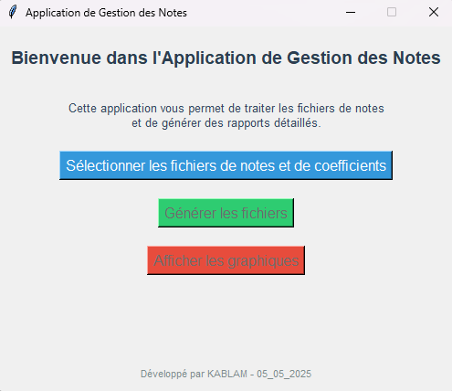

#### Étape 1 : Sélection du fichier des coefficients
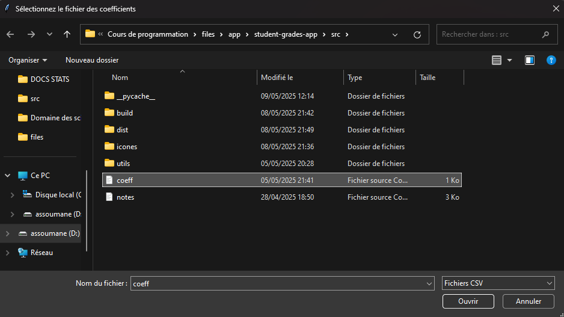

#### Étape 2 : Sélection du fichier des notes
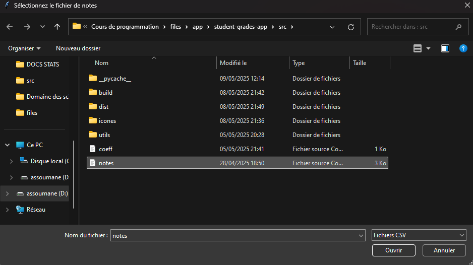

Une fois les fichiers sélectionnés, le bouton **"Générer les fichiers"** est activé.

---

### 2. **Génération des fichiers**
L'utilisateur clique sur le bouton **"Générer les fichiers"**. Une barre de progression s'affiche pendant le traitement.

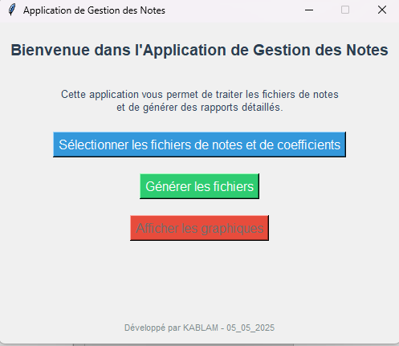

#### Message de succès après la génération des fichiers
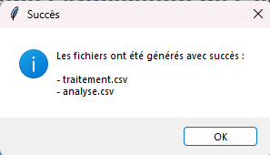

Les fichiers générés sont :
- `traitement.csv`
- `analyse.csv`

#### Fichiers générés dans le répertoire
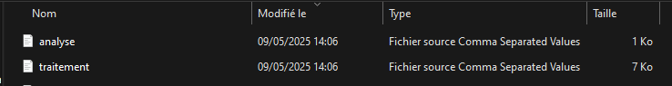

---

### 3. **Affichage des graphiques**
L'utilisateur clique sur le bouton **"Afficher les graphiques"**. Les graphiques des statistiques par matière sont affichés dans une nouvelle fenêtre.

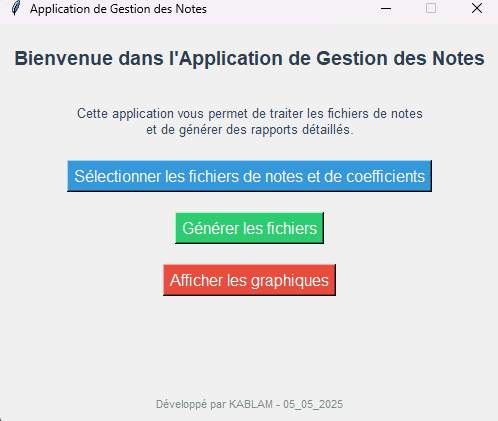

#### Graphique 1 : Statistiques par matière
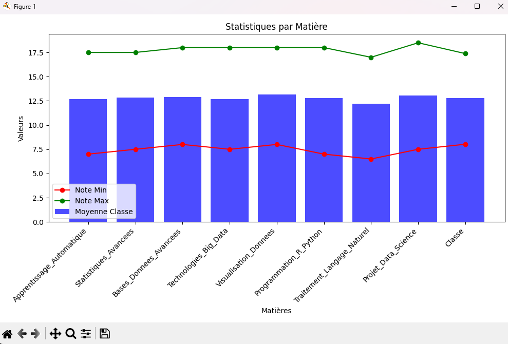

- **Barres bleues :** Moyenne de la classe par matière.
- **Points rouges :** Notes minimales par matière.
- **Points verts :** Notes maximales par matière.

#### Graphique 2 : Effectifs par matière
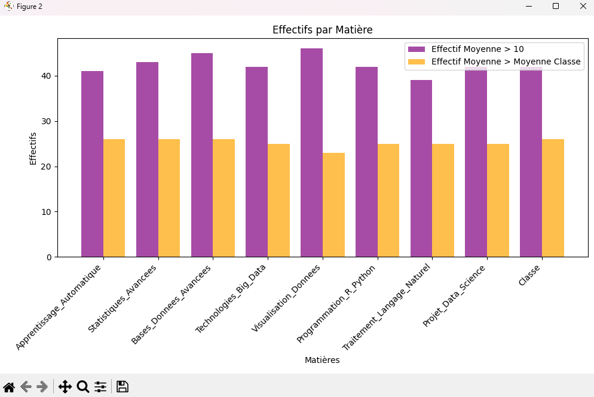

- **Barres violettes :** Effectifs des étudiants ayant une moyenne > 10.
- **Barres oranges :** Effectifs des étudiants ayant une moyenne > moyenne de la classe.

---

### 4. **Fichiers générés**
Les fichiers générés contiennent les données suivantes :

#### Exemple de fichier `traitement.csv`
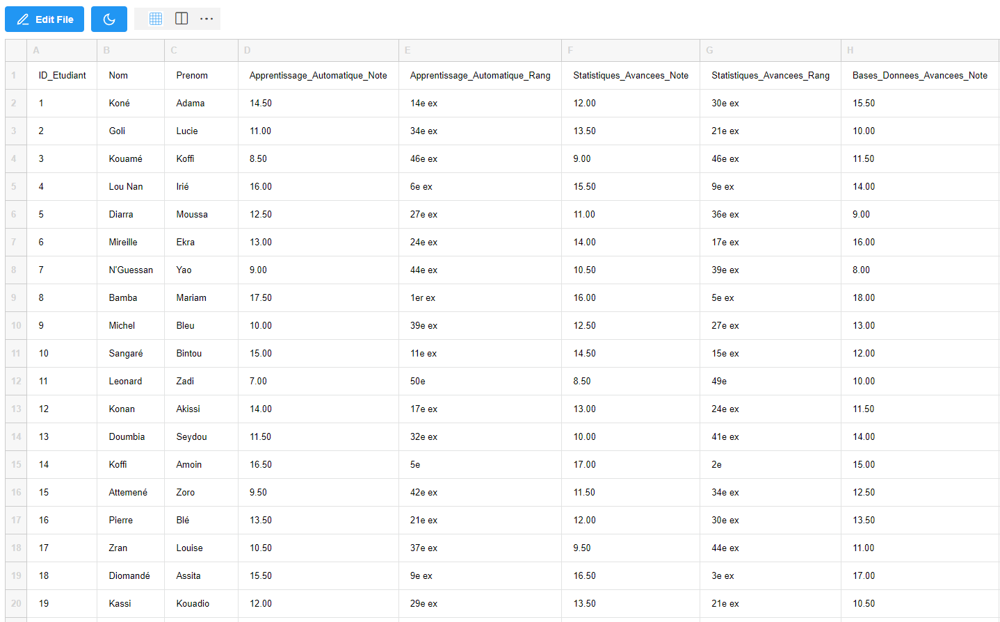
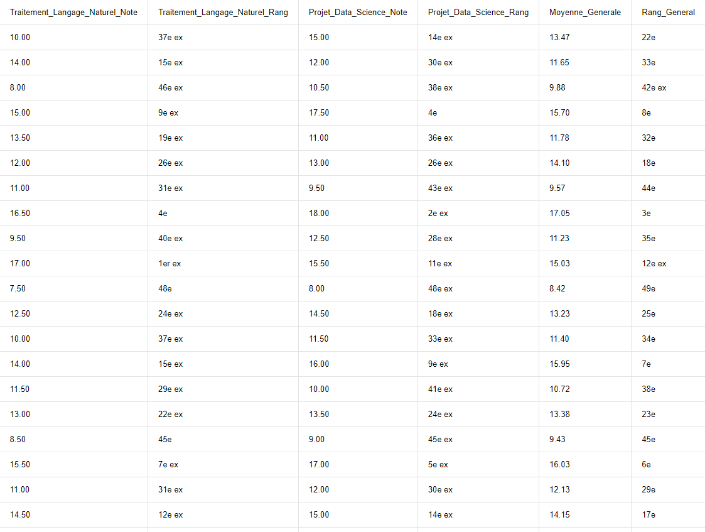
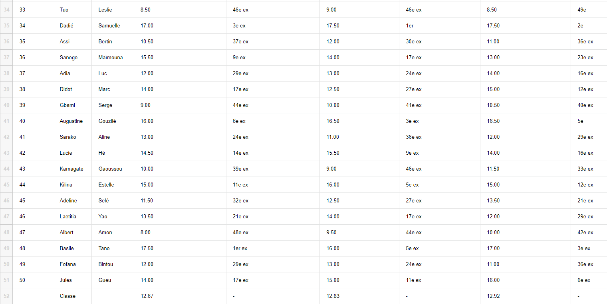
#### Exemple de fichier `analyse.csv`
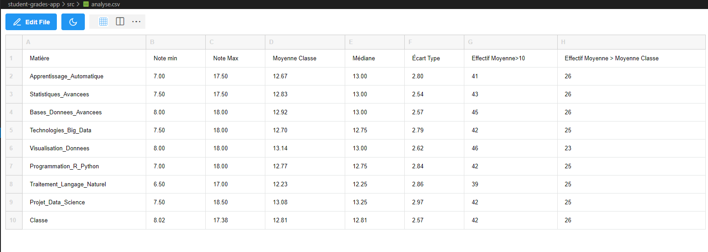

---

### Interface utilisateur
Voici l'interface principale de l'application :


